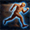
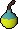

+++
title = 'AgentChronia'
summary = 'Using Reinforcement Learning to build an agent to traverse a virtual obstacle course with Proximal Policy Optimization (PPO).'
languageCode = 'en-us'
date = 2025-06-06
draft = false
tags = ['notes', 'reflections']
showRecent = true
showTableOfContents = false
+++



The goal is to build an agent to optimally traverse a ~5 minute obstacle course in the online game Runescape. By building an agent that can take the same actions as a player can for moving around a grid based map, the goal is to try and train an agent using proximal policy optimization (PPO) to complete the course in the fastest time.

I want to see if the agent can come up with new strategies that the human playerbase did not think about, and if it can even break the current record for fastest course completion.

This project uses the mlagents package in Unity.


# Implementation Details

## Agent actions
In Runescape, there are several actions you can take to navigate the tile-based map around you. You can, of course, walk in any cardinal & ordinal direction, but there are also a few special abilities you can use to move around faster.

<div style="display: flex; align-items: flex-start; gap: 20px;">

  

  **Surge:** Moves you 10 tiles in the direction you are facing. If there is an obstacle in the way, you will stop at that obstacle.

</div>

<div style="display: flex; align-items: flex-start; gap: 20px;">

  

  **Sticky Bombs:** Among other items, you can throw these to re-orient and change the direction your character is facing. This can combo well with surge to allow you to surge in any direction you desire.

</div>

<div style="display: flex; align-items: flex-start; gap: 20px;">

  

  **Dive:** Teleports you to any tile within 10 tiles from your character. This only works if your player can "see" the tile. See this explanation for what that means:

</div>

<!-- ---

 **Surge:** Moves you 10 tiles in the direction you are facing. If there is an obstacle in the way, you will stop at that obstacle.

 **Sticky Bombs:** Among other items, you can throw these to re-orient and change the direction your character is facing. This can combo well with surge to allow you to surge in any direction you desire.

 **Dive:** Teleports you to any tile within 10 tiles from your character. This only works if your player can "see" the tile. See this explanation for what that means: -->


```
public int isDiveable(int mypos_x, int mypos_z, int targetpos_x, int targetpos_z)
{
    ... //variable initialization

        while((vertDist > 0) || (horiDist > 0))
        {
            movedVert = false;
            movedHori = false;

            if((horiDist > 0) && map[localpos.First, (localpos.Second + horiMag)] == 0)
            {
                localpos.Second = localpos.Second + horiMag;
                horiDist = horiDist - 1;
                movedHori = true;
            }
            if((vertDist > 0) && map[(localpos.First+ vertMag), localpos.Second] == 0)
            {
                localpos.First = localpos.First + vertMag;
                vertDist = vertDist - 1;
                movedVert = true;
            }
            //we havent reached the goal square but we cant move e/w or n/s to get closer
            if(!movedVert && !movedHori)
            {
                return 1;
            }
        }
        //we only exit if both vert and hori Dist are 0, meaning we can reach the tile
        return 0;
}
```

The agent was created with several different actions to capture the different types of abilities that are available to a Runescape player to allow them to navigate the tilemap more quickly.
```
const int k_NoAction = 0;  // do nothing!
const int k_Up = 1;
const int k_Down = 2;
const int k_Left = 3;
const int k_Right = 4;
const int k_UpLeft = 5;
const int k_UpRight = 6;
const int k_DownLeft = 7;
const int k_DownRight = 8;
const int change_dir_north = 9;
const int change_dir_northeast = 10;
const int change_dir_east = 11;
const int change_dir_southeast = 12;
const int change_dir_south = 13;
const int change_dir_southwest = 14;
const int change_dir_west = 15;
const int change_dir_northwest = 16;
const int surge = 17;
//actions 18-459 are assigned to the 21x21 square around your character for all diveable tiles.
```
The agent also had internal cooldowns that controlled the action mask so that the agent could only use these abilities every ~17 steps or so, just like in Runescape.


So the agent had an action space of 459 actions, where obstacles and cooldowns would mask out the space. This large action space may make learning difficulty for the Agent, but we press on.

## Environment and Rewards

I used tile-maps from Runescape's cache files to reconstruct the 51 floors of the in-game obstacle course in Unity.



During training, several parallelized instances of the obstacle course map were used to allow the agent to interact with the environment at a faster scale, and learn positive behaviors earlier in the training process:


The reward function I used for the agent is as follows:

<!-- $$
\begin{aligned}
&\Large \textbf{Reward} = R_{\text{exist}} + R_{\text{dist}} + R_{\text{surge}} + R_{\text{inertia}} + R_{\text{floor}} + R_{\text{goal}} \\
\\
&\textbf{where:} \\
\\
&R_{\text{exist}} = -0.5 \quad \text{| *static negative reward for just existing} \\
\\
&R_{\text{dist}} = \beta \times \text{distanceToTarget} \times \text{floorMod} \quad \text{| *small reward based on distance to target; more prevalent on earlier floors} \\
&\qquad\text{floorMod} = 0.1 \times (51 - \text{maxFloorReached}) \\
\\
&R_{\text{surge}} = \alpha \quad \text{(only if action} \geq 17\text{, else 0)} \quad \text{|  *small reward to incentivize using special abilities}\\
\\
&R_{\text{inertia}} = \gamma \times \left(\frac{1}{\text{averageChange} + \varepsilon}\right) \quad \text{|  *rewards moving around more} \\
&\qquad\text{averageChange} = \text{average of absolute distance differences over last } \omega = 5 \text{ steps} \\
&R_{\text{floor}} = +100 \quad \text{(if agent reaches the next floor)} \\

&R_{\text{goal}} = +10000 \quad \text{(if agent reaches final room)}
\end{aligned}
$$ -->


The hyperparameter values used in training were:
<!-- $$
\beta = -0.05\\
\alpha = 0.005\\
\gamma = -0.01 \\
\varepsilon = 0.01 \text{(prevents divide-by-zero)}
$$ -->


## PPO

The algorithm used to train my agent was Proximal Policy Optimization (PPO). In this section I will talk briefly about what PPO is and how it works.  Feel free to jump ahead to the initial results.

<!-- $$
L^{\text{CLIP}}(\theta) = \mathbb{E}_t \left[ \min \left(
r_t(\theta) \hat{A}_t,\
\text{clip}(r_t(\theta),\ 1 - \epsilon,\ 1 + \epsilon) \hat{A}_t
\right) \right]
$$ -->


where

<!-- $$
r_t(\theta) = \frac{\pi_\theta(a_t \mid s_t)}{\pi_{\theta_{\text{old}}}(a_t \mid s_t)}
$$ -->


PPO, like other policy gradient methods, aims to maximize the reward objective specified by the agent's policy. This means that the algorithm defines a policy π for the agent that determines the probability of taking certain actions in certain states. This policy is iterated on to try and maximize the reward the agent recieves from its environment. The key to PPO, is that there are additional components of the objective function to ensure regularization. Stable learning is achieved by adding a clip function on the ratio between the new and old policy probabilities. This clips the advantage/improvement, and enforces small updates to the policy, leading to more stable improvement.

## Initial Results

Originally I tested this on just a single floor, and was able to achieve an optimal behavior for just that floor. The agent actually performed a sequence of moves that was one step faster than the actual world record on this floor!

See here: https://youtu.be/2S2oA0Il4a4

The next step was to consider all tilemap floors and try to optimize for the entire obstacle course as a whole.

The agent was able to successfully traverse all 51 floors,however, because the agent was rewarded so heavily for completing a floor, there was no real optimization on a specific floor level. The agent would just repeat the path it took to reach the end, even if that meant wandering for a while on a specific floor before finding the target and moving on to the next floor.

The agent tended to complete earlier floors more efficiently, but struggled navigating later floors in a timely manner. In some cases, it would abuse local rewards for surging/diving and being close to the target to circumvent rewards for completing the floor. (See example 2)

Example 1: A close to optimal pathing of early floors



Example 2: Reward hacking



## Next steps

I think the reward function could be tuned more, and hyperparameters optimized as well. I found myself often removing the distance, surge and inertia rewards. They contributed to faster completions of floors during training, but resulted in a misallocation of rewards, having the agent abuse spamming surge and dive, or get stuck in corners proximal to the target (see example 2).

There are a few more things I want to try to improve performance. The first is something called **curriculum learning**. The idea here is that I control what the agent learns and in what order. If I first train one or several agents on each floor one by one, and then have them learn navigating the entire course, the agent might have a better idea of how to optimally navigate each individual floor, and then learn subleties in prioritization to navigate the entire course as fast as possible.

The other idea I had, since I am really just trying to find an optimal set of actions to get through the course as fast as possible, would be to train an agent on every floor for every possible initial state (e.g. floor 5 with cooldown=14; floor 5 with cooldown = 7; floor 6 with cooldown=0; etc.) and then construct a graph linking possible states and use a search algorithm like DFS to search through the graph to find the minimum possible time.


[Github Repo](https://github.com/ubitquitin/agentchronia/tree/master)

