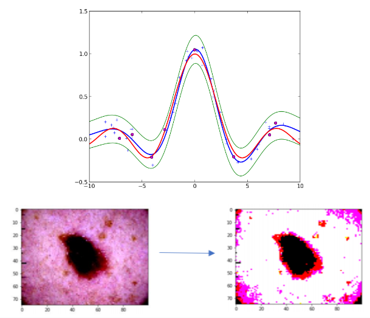

+++
title = 'Bayesian Skin Cancer Classification'
summary = 'Image classification using Bayesian Neural Networks, Gaussian Process Regression and Relevance Vector Machines.'
languageCode = 'en-us'
date = 2019-03-22
draft = false
tags = ['notes', 'reflections']
showRecent = true
showTableOfContents = false
+++

Used a Relevance Vector Machine, Gaussian Process Regression and Bayesian Neural Networks for supervised multiclass classification of skin cancer images. Python Sci-kit Learn and Edward packages used for model construction and validation

[Presentation](https://docs.google.com/presentation/d/1vw80pKNvklOluIgGVs5ZZvF3uOw3nwrHGyds_V8jTdQ/edit?usp=sharing)

