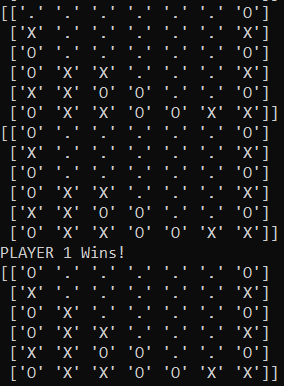

+++
title = 'Connect4 Q'
summary = 'A Connect 4 AI agent built with Reinforcement learning.'
languageCode = 'en-us'
date = 2022-01-06
draft = false
tags = ['notes', 'reflections']
showRecent = true
showTableOfContents = false
+++

Explored reinforcement learning agents by implementing Q-learning and Deep Q-learning to train an agent to play connect 4 via self-play.

[Github Repo](https://github.com/ubitquitin/Connect4_Q)

