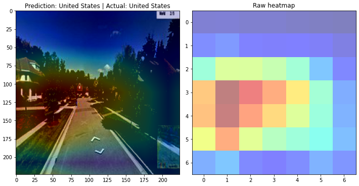
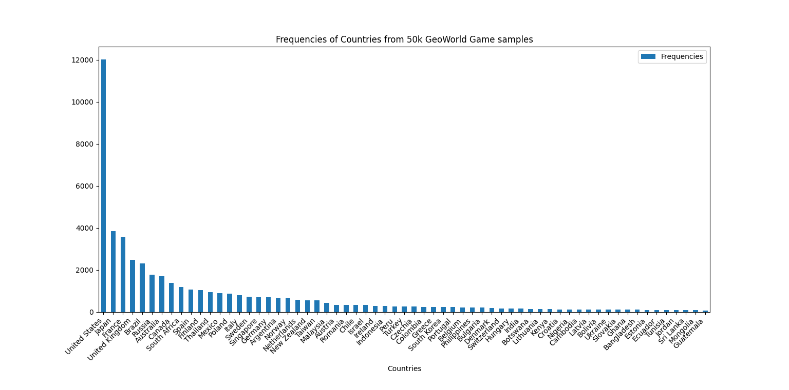
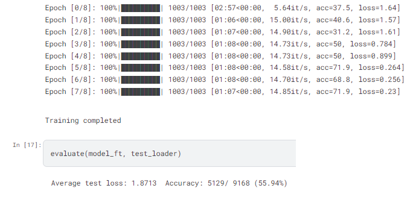
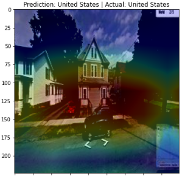
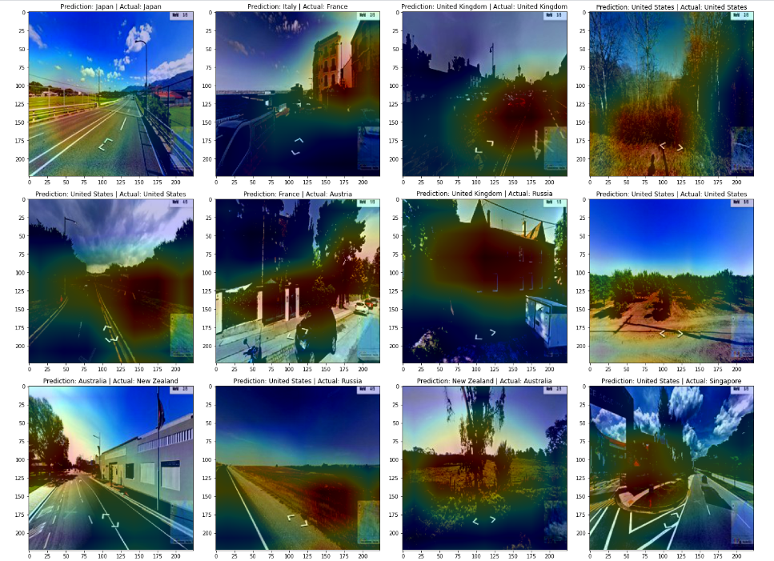

+++
title = 'DeepGeoWorld'
summary = 'Deep Learning for GeoLocation. Using CNN/Computer Vision & custom Pytorch datasets. GradCAM for model explainability.'
languageCode = 'en-us'
date = 2024-01-17
draft = false
tags = ['notes', 'reflections']
showRecent = true
showTableOfContents = true
+++


### Summary:
*What country is this image from?*


Geolocation/Image Classification using a Convolutional Neural Network (CNN) built with PyTorch. A PyTorch custom dataset was built via web-scraping with Python Beautifulsoup and Geopy libraries. Explored activation maps for AI explainability.

[Github Repo](https://github.com/ubitquitin/DeepGeoWorld) | 
[Notebook](https://www.kaggle.com/code/ubitquitin/this-is-america-deep-geolocation)

- - - - - - - - - - - -

# More Details:

### Dataset creation

The goal of this project was to create an AI that could perform 'reasonably' well at the popular online game [GeoGuessr](https://www.geoguessr.com/). This is a game where you are dropped into a random location on Google Street View, and have to determine where in the world you might be.

In order to get started the first task I had to tackle was dataset creation. I created a Python script that used BeautifulSoup and Selenium libraries to parse webpages and perform actions such as button clicks to navigate through the game. The script would:

<ol type="1">
  <li>Load into a Geoguessr Game.</li>
  <li>Fetch the latitude and longitude information embedded in the html page (this is how scripts can cheat at the game, the answers are embedded in the webpage!).</li>
  <li>Lookup the correct country based on the latitude and longitudinal information using the GeoPy library.</li>
  <li>Take a screenshot of the streetview location and save to disk under the appropriate country folder.</li>
  <li>Click and guess a random area on the map guessing interface in order to move onto the next round.</li>
  <li>Once all 5 rounds in the geoguessr game are completed, move onto the next round!</li>
</ol>

Video of script running:
*There's a gaming ghost in my house!*



The final dataset was uploaded to Kaggle here: https://www.kaggle.com/datasets/ubitquitin/geolocation-geoguessr-images-50k (Cool that other data scientists are using it!)

### Data preprocessing with custom Pytorch Datasets

Now, I wanted to create a machine learning model that could learn off of this image data to predict the country the image was taken in. This became a multiclass classification problem, with ~200 (number of countries) classes to pick from. That's a large cardinality for class labels, so I wanted to reduce this number down. I immediately noticed there were a few countries that only appeared once or twice in the 50,000 images. To drastically reduce the number of possible country classes, I created custom Pytorch Dataset and Dataloader classes, with built in custom thresholds to filter out any data folders with less than 200 image datapoints. 



I used label encoding to encode the resulting 40 classes: 

```
{0: 'Argentina', 1: 'Australia', 2: 'Austria', 3: 'Belgium', 4: 'Brazil', 5: 'Bulgaria', 6: 'Canada', 7: 'Chile', 8: 'Colombia', 9: 'Czechia', 10: 'Finland', 11: 'France', 12: 'Germany', 13: 'Greece', 14: 'Indonesia', 15: 'Ireland', 16: 'Israel', 17: 'Italy', 18: 'Japan', 19: 'Malaysia', 20: 'Mexico', 21: 'Netherlands', 22: 'New Zealand', 23: 'Norway', 24: 'Peru', 25: 'Philippines', 26: 'Poland', 27: 'Portugal', 28: 'Romania', 29: 'Russia', 30: 'Singapore', 31: 'South Africa', 32: 'South Korea', 33: 'Spain', 34: 'Sweden', 35: 'Taiwan', 36: 'Thailand', 37: 'Turkey', 38: 'United Kingdom', 39: 'United States'}
```

### Deep Learning

*Discussing the fundamental math and intuition behind machine learning techniques such as the Convolutional Neural Network is out of scope for this discussion. For a good intuition on Convolution Neural Nets, check out this [link](https://ujjwalkarn.me/2016/08/11/intuitive-explanation-convnets/).*

Now that I had my torch dataset, I trained a ResNet18 Convolutional Neural Network with stochastic gradient descent and crossentropy loss for 8 epochs. I used an exponential LR scheduler to decay the learning rate by an order of magnitude every few epochs, stabilizing the model training. I set the batch size to 32. Training took ~10 minutes using Kaggle's built in GPU acceleration, with ~ a minute per epoch.



Training accuracy settled at ~72%, while test accuracy upon evaluation was ~55%. While this might jump out as awfully low, being only a 1/2 chance for the model to get the correct country from an image, keep in mind that the dataset being trained upon has 40 different possible answers for countries, so 50% is far better than a truly random 1/40 (2.5%) accuracy.


### Model Explainability

One intruiguing thing about using neural networks is that they are a black box. We don't immediately understand what it is about the input images that is important in contributing to the model's decision. What in the images does the model actually consider important for determinign the country? Also, the images in my dataset all contain artefacts of the geoguessr UI that could be contributing to noise (uninformative information) in the images. How can I better understand what the neural network is doing?

That's where GRADCAM comes in!
This [article](https://glassboxmedicine.com/2019/06/11/cnn-heat-maps-class-activation-mapping-cam/) does a better job visualizing and explaining GradCAM than I could ever do, but I'll take a stab at it here anyways:

When convolutional neural networks (CNN) learn patterns based on images, they build maps of image features that contribute information towards what class the image might belong do. For example, long straight lines might represent whiskers for determining if an image is a cat or dog. As we add more layers and go deeper in a CNN, the features become more complicated and build off of the earlier more basic lines and shape features. GradCAM takes the most complex feature maps from the end of the convolutional neural network, and pools (sums and averages) this information to generate contributions of each feature map to the class prediction of the neural net.

Let's look at a quick example. 



When I look at the image above, I can see that the model predicted the country of origin was the United States, and it indeed was!
GradCAM takes whatever patterns (feature maps) the model has come up with and looks at the importance of these patterns that contribute to the United States class. Perhaps there's a pattern for cactus shapes in the model, but this would have a low weight/importance for this image, since we dont see many cacti in the US. Perhaps theres a pattern for suburban looking houses, and that will have a high weight/importance, as the model sees this pattern emerge often in the US. And perhaps there's a blue sky pattern, this may also match with the image, but have low weights as it may not be important to the models decision making, if it always sees a blue sky regardless of country. 



Looks like the geoguessr UI elements are pretty unimportant- good. Overall it looks like buildings and focal points of the image seem to be the most important contributors to the model's decision making, but it is interesting how the model seems to target folliage often over obviouss giveaways like cars or even flags. 

### Next Steps

Thats it for now! If I would continue this effort, I would want to spend more time optimizing the model training and improving accuracy, as well as analyzing where the gradCAM images show that the model goes awry. Thanks for reading if you made it this far!


