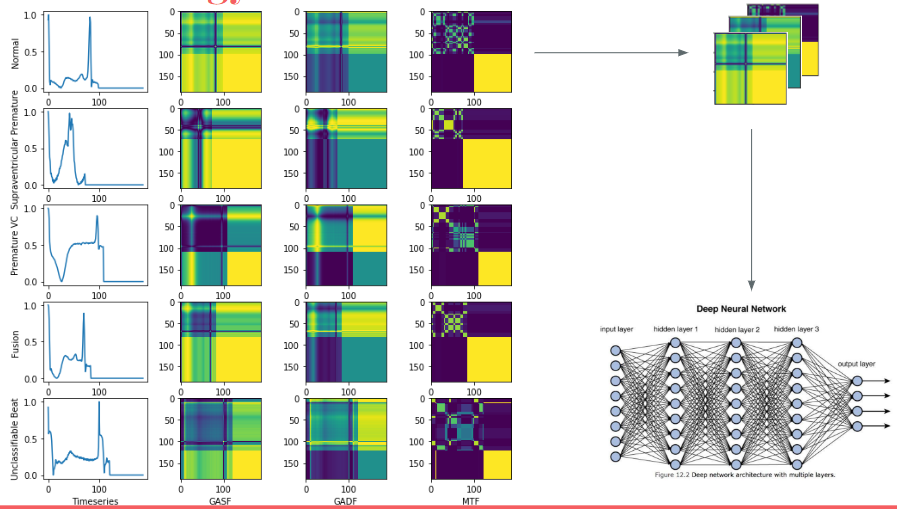

+++
title = 'Heartbeat Classification'
summary = 'Deep learning heart disease multiclassification using LSTM/CNN/GANs.'
languageCode = 'en-us'
date = 2022-04-04
draft = false
tags = ['notes', 'reflections']
showRecent = true
showTableOfContents = false
+++

Comparative analysis of deep learning methodologies to predict heart disease from heartbeat ECG waveforms. LSTM models, transformer networks, timeseries to image encodings, CNN, tiled-CNN, and transfer learning methodologies were explored to maximize accuracy. Generative adversarial networks (GAN) were developed to generate realistic heartbeat samples to augment dataset.

[Presentation](https://docs.google.com/presentation/d/1jgeSdeDLxl9CX1P57JNbuJtp4bThPDfPLt2CidsuxXo/edit?usp=sharing) | 
[Notebook](https://www.kaggle.com/code/ubitquitin/tsc-exploration)
