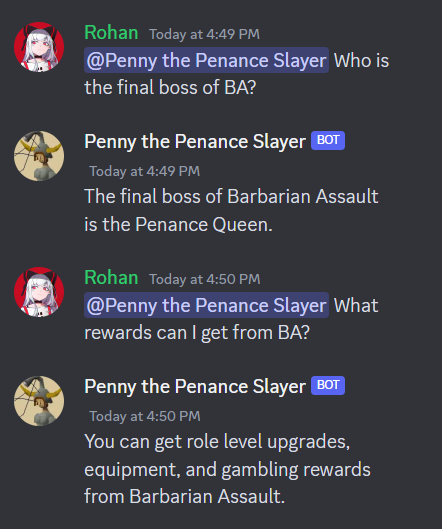

+++
title = 'PennyBot'
summary = 'Subject matter expert chatbot created using LLMs & RAG. Deployed to private Discord servers using Replit.'
languageCode = 'en-us'
date = 2023-08-23
draft = false
tags = ['notes', 'reflections']
showRecent = true
showTableOfContents = false
+++

A GPT-3 powered Q&A chatbot finetuned and utilizing retrival augmented generation (RAG) & semantic search. Able to answer specific questions about an online video game. 

[Github Repo](https://github.com/ubitquitin/pennybot)

