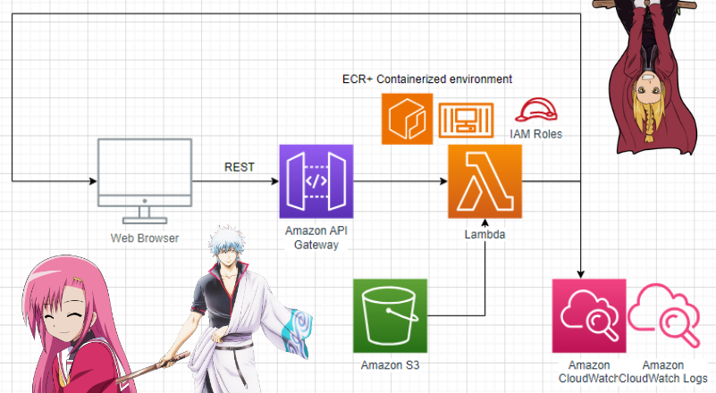

+++
title = 'Anime Recommendations Model'
summary = 'Collaborative Filtering vs LLM based recommendations. Deployed with serverless AWS stack.'
languageCode = 'en-us'
date = 2023-12-21
draft = false
tags = ['notes', 'reflections']
showRecent = true
showTableOfContents = true
+++
# Anime Recommendations with serverless infrastructure
### Summary:

Anime recommendation service that returns top n most similar shows to the user's queried show. Neural Collaborative Filtering was implemented and embeddings deployed onto a RESTful endpoint. Serverless framework was used to spin up API Gateway + Lambda stack using infrastructure as code development. Additional endpoint deployed that utilizes LLM embeddings to and compare a user based recommendation approach with a text similarity one.

[Try it out]() | [Github Repo](https://github.com/ubitquitin/mal_reccos)

- - - - - - - - - - - -

# More Details:

### NCF
__What is NCF?__
* Collaborative filtering, a very commonly used method in recommendation systems, essentially decomposes a matrix of users and their ratings or interactions with items into the product of two matrices. By doing so, one can obtain embeddings of items and users with respect to some latent feature dimension. This allows for an understanding of users and items in the context of this latent dimension, and extrapolation of similarity for items or users that have not yet interacted.
  
_Chupakhin, Andrei & Kolosov, Alexey & Smeliansky, Ruslan & Antonenko, Vitaly & Ishelev, G.. (2020). New approach to MPI program execution time prediction._
* Item user interactions in this latent space can be more complex than just the dot product operation used to concatenate the embeddings. *Neural collaborative filtering* adds a feedforward neural network on top of the embeddings to represent a more complex, nonlinear function.
* The following neural collaborative filtering model was implemented, following guidance of the original paper:

  _arXiv:1708.05031_

Code for the neural network implementation can be found here: [KAGGLE NOTEBOOK](https://www.kaggle.com/code/ubitquitin/anime-recommendation)

---

### Serverless Orchestration

In order to create a machine learning powered anime recommendation website, the following infrastructure was implemented using the [serverless framework](https://www.serverless.com/). This framework allows for easy deployment of AWS lambda services with infrastructure as code style deployment. 

To hold sklearn, numpy and pandas libraries, a docker image was created and pushed to ECR. The Lambda was configured to run on this container to allow for encoding of incoming anime queries to the embedding space of the NCF model. From there, pandas and numpy functions were used to calculate the top n most similar anime in the dataset.

Because the pandas dataset load was expensive, caching was used to make multiple requests after the Lambda warmed up much faster. 

---

### LLM

As an extra exploration step, HuggingFace's [sentence-transformer](https://www.sbert.net/) library was used to encode anime synopses as large language model numerical vectors. This allowed for a similarity score to be computed pairwise between all of the anime in the dataset, that would be based on a language model's understanding of the text similarity. So instead of user based ratings implemented in the NCF, the similarity of the text of the synopsis was used as an alternative recommendation style. 

---

### Similarity score

Dot product was used for NCF similarity score.
Cosine similarity was used for LLM similarity.
Cosine similarity is simply dot product normalized by the scalar product of two matrices: 

_Almatrooshi, Fatima & Akour, Iman & Alhammadi, Sumayya & Shaalan, Khaled & Salloum, Said. (2020). A Recommendation System for Diabetes Detection and Treatment. 10.1109/CCCI49893.2020.9256676._
* This is a desirable metric for word vector embeddings if we do not want to consider the magnitude, or occurrence of a word. 
* Dot product was used for the NCF approach because it results in a faster calculation. Because the user-item dataset fed to the NCF model was just binary in data (1 = interaction, 0 = no interaction), the resulting embeddings were already normalized.