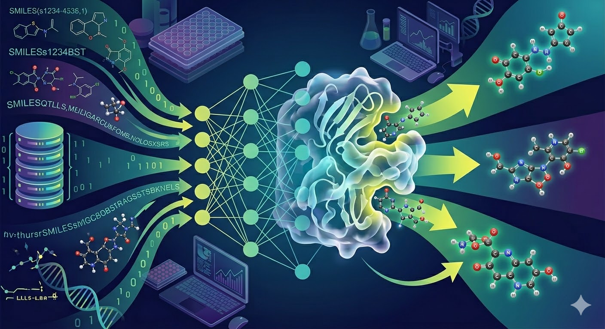

+++
title = 'Smolmol: My Small Molecule ML/AI Exploration Journey'
summary = 'Documenting my journey learning about small molecule discovery with ML/AI.'
languageCode = 'en-us'
date = 2026-03-23
draft = false
tags = ['notes', 'reflections']
showRecent = true
showTableOfContents = true
+++
# Smolmol: My Small Molecule ML/AI Exploration Journey
### Summary:

I want to pursue Machine Learning and Artificial Intelligence in applications that benefit the world, and are rooted in scientific discovery. To this end, I am interested in bioinformatic/cheminformatic applications of AI/ML. Having no formal industry experience, this is my self-study journey to cover key concepts and gain relevant experience. My end goal is to be contextually aware of SOTA in these fields, and be able to contribute meaningfully.

Week 1: [Molecular Representations and ML with Rdkit+DeepChem]()
Week 2: coming soon.

[Github Repo](https://github.com/ubitquitin/smolmol)

- - - - - - - - - - - -