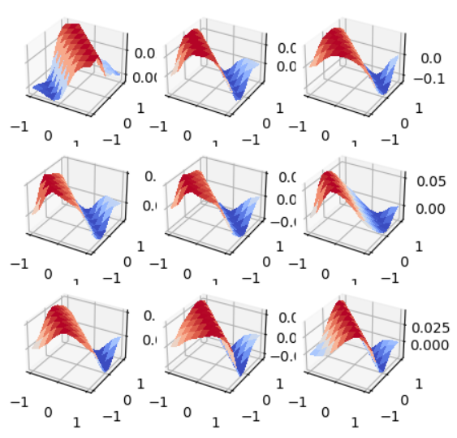

+++
title = 'Visualizing KAN-CNN Filters'
summary = 'Exploring visualization of Convolutional Kolmogorov-Arnold Network (KAN-CNN) filters, to gain better insight to how these new MLP alternatives can learn image patterns.'
languageCode = 'en-us'
date = 2024-06-06
draft = false
tags = ['notes', 'reflections']
showRecent = true
showTableOfContents = false
+++

For a more readable experience, please check out the [linkedIN article](https://www.linkedin.com/pulse/visualizing-kan-cnn-filters-rohan-khopkar-bwlgc/)

--------

Kolmogorov-Arnold Networks (KAN) networks are a new type of neural network that provide an alternative framework to the typical multi-layer perceptron (MLP). In this article I hope to explain how these networks work, discuss extrapolation to computer vision architecture, and try to visualize & interpret learned features for these networks.

## The Kolmogorov-Arnold Representation Theorem

![where 𝜙𝑞,𝑝: [0,1]→𝑅 and Φ𝑞: 𝑅→𝑅](image.png)

This theorem states that any multivariate function f(x₁,x₂,x₃,...) can be expressed as a superposition of univariate functions f(x₁), f(x₂), f(x₃). In simpler terms, any function of multiple variables can be represented as a function of single variable functions, added together in some fashion. The [KAN paper](https://arxiv.org/abs/2404.19756) worded it well: 

> "In a sense, they showed that the only true multivariate function is addition, since every other function can be written using univariate functions and sum."

Looking at examples always helps:

**f(x,y,z) = xyz = e^(ln(x) + ln(y) + ln(z))**  *where x > 0, y > 0, z > 0*

[source](https://math.stackexchange.com/questions/2518664/are-there-any-simple-examples-of-kolmogorov-arnold-representation)

Here we represent a multivariate function as a sum of univariate functions. Representations for more complex functions are hard to express as the proof for this theorem is non-constructive, and inner functions tend to become non-smooth, which has led to hesitation of adoptation from the ML community.

## Multilayer Perceptron (Standard Neural Networks)

Neural networks can be thought of as multidimensional (read: multivariate) curve fitting. We have some data, where each attribute of the data is a dimension/variable, and we try to fit some curve that best approximates the trend of this multivariate data. MLPs (standard neural nets) do this via a combination of nonlinear transformations on learned linear regressions. 

h₁ = a(w₁*weight + w₂*height + b₁) | h₂ = a(w₃*weight + w₄*height + b₂), where a(●) is some nonlinear function.

[source](https://towardsdatascience.com/neural-networks-and-the-universal-approximation-theorem-8a389a33d30a#:~:text=The%20Universal%20Approximation%20Theorem%20tells,number%20of%20inputs%20and%20outputs.)

The linear regression description of neural nets make MLPs sound naïve, but in practice we see that by adding more nodes per layer, we can represent more complex multivariate functions. (This is called the universal approximation theorem)
## KAN Networks

KAN networks are doing something similar, but instead of learning weights for linear regressions that will be fed into a nonlinear function, we learn the nonlinear function itself. 

One common visualization of this difference is that in MLP we parametrize the nodes of the computational graph, and in KAN we parametrize the activation function edges of the computational graph. 

From the [KAN paper](https://arxiv.org/abs/2404.19756): 

In both cases we are learning the weights for some parametrized nonlinear function, but with KANs we are not restricted to linear functions and we are not restricted to the same activation function for all nodes of a given layer.

------------------------------------------------------------------------

The crux of this framework is the *scalability* to high dimensional problems. MLPs suffer from the curse of dimensionality, where representing data in high dimensional spaces makes all data look equally dissimilar and reduces information available. To this end machine learning problems often simplify the number of input dimension to a model at the cost of potential information or nuance. 

But KAN networks don't look at the multivariate feature space as a whole. They learn in univariate space for each of the 𝜙𝑞,𝑝, thus partially overcoming the curse of dimensionality. This allows KAN networks to potentially exhibit higher accuracy without needing to scale out the number of nodes per layer as much, saving parameter count. *(This was only tested in the paper on partial differential equations, but if these networks scale to high dimensional problems like understanding natural language, we could potentially see memory requirements diminish for LLMs!)*

------
Regarding parameter count, the paper mentions the following for a particular network layer:
> KAN ~ O(N²G) where N is the number of nodes in a layer, and G is the graph size

> MLP ~ O(N²) where N is the number of nodes in a layer

KANs have seemingly more parameters than MLPs, but again, due to overcoming the curse of dimensionality, N tends to be smaller in KANs.

You might be wondering what this "graph size" is. This comes about because we are learning nonlinear functions at multiple levels of granularity. We are learning the weights applied to each 𝜙𝑞,𝑝 (network edge) to be added together to represent the final multivariate function, but we are also learning the form of each 𝜙𝑞,𝑝. So we not only need to learn the weights applied to every univariate function, 𝜙𝑞,𝑝 , but we also need to learn weights applied to even more basic functional building blocks that constitute 𝜙𝑞,𝑝. In the KAN paper these "building blocks" are B-splines, but theoretically could be any basis function. So the graph size essentially corresponds to the number of basis functions we use to represent a single univariate function that is an edge in our KAN network.

*𝜙𝑞,𝑝 is represented as a summation of weighted basis functions (B-splines).* 

If this doesn't make sense, think back to the Fourier transform. A waveform can be represented as a sum of a bunch of waves with different frequencies. So to learn our univariate function (network edges), we learn weightings on these "building block" functions and add them together to create a more complex nonlinear function.

Fourier decomposition: 

So in summary:

- We have to learn some multivariate function Φ𝑞 that is a function of some univariate functions 𝜙𝑞,𝑝 added together.
- How do we know what these univariate functions even look like? We learn weights for an additive combination of basis (building block) functions. This combination can then result in any sort of nonlinear univariate function 𝜙𝑞,𝑝 that can be aggregated in the larger nonlinear function Φ𝑞.

## Convolutional KANs
Convolutional neural networks are a specialized architecture of neural nets for computer vision and image related problems. They typically solve image related tasks by learning important features of image data. These learned features are represented as small filters that are convolved over an input image to produce an activation map. The computational graph can then learn how prevalent each feature is in the image and use that for some downstream task.

Studies have shown that earlier lower layers in the neural net tend to learn basis functions, such as line or edge detectors and simple patterns, whereas later layers learn more complex features. 

[Source](https://blogs.nvidia.com/blog/whats-the-difference-between-a-cnn-and-an-rnn/) 

I wanted to visualize the learned kernels of a KAN-CNN architecture, and see if we notice the same trend for complexity of the kernel functions.

The main difference between traditional CNNs and KAN-CNNs are that the kernels are not just matrices of coefficients, they are actually matrices of univariate functions 𝜙𝑞,𝑝.

I found a [github implementation of the convolutional KAN](https://github.com/AntonioTepsich/Convolutional-KANs/tree/master) from authors Alexander Bodner, Antonio Tepsich, Jack Spolski and Santiago Pourteau, and tried to visualize some of the kernels of a network trained on MNIST digit dataset.

## Visualization of Kernels
Using their implementation of a network with 2 KAN_Convolutional layers (5 convolutions ea.) followed by a KAN linear layer, I ran training for just 1 epoch on the MNIST digit dataset.

With the test loss also considerably low, I decided this was sufficient training to go ahead and visualize the learned filters.

*Kernels for Convolutional KAN*

Here are the learned KAN kernel filters for each of the 10 convolutions. For simplicity, the output feature count for each convolutional layer was set to 1, so that there was just one feature kernel learned per layer. So as we convolve each 3x3 grid of functions across an image, we get a more complex activation based on the pixel values of the input image. In lower, initial layers, we might be seeing something similar to the CNN, where basic line and shape patterns are learned.

*First convolutional layer's kernel*

If -1 is black and 1 is white for a normalized single channel image, we could potentially interpret the above kernel as:

*Say we try and binarize the nonlinear kernel functions above, we might get colors like this.*

Which is looking a lot like a horizontal line pattern.

Meanwhile, the Kernels towards the end of the KAN-CNN exhibit seemingly more complex nonlinear functions.

*Last convolutional layer's kernel*

I also played around with visualizing the Kernel functions in a 2D meshgrid (from -2 in the top left to +2 in the top right of the input matrix.)

*Visualizations for Convolutional KAN Kernels with 2D inputs*

Also, our Kernel function was initialized to SILU, shown below.

*SiLU visualization*

It is interesting to see that some Kernel entries take on this pattern even after training for the lower layers:

*3rd convolutional layer*

It is also interesting to see how the first convolutional layer acts as somewhat of a filter for large negative (black in monochrome channel?) intensities:

*1st convolutional layer*

Lastly, although the nonlinear function becomes more complex in later convolutional layers, the y-axis seems to maintain an extremely small range for all kernels. I need to dig into this further to see what's going on.

*10th convolutional layer*

So that's my current progress thusfar. I hope to continue diving into interpretability of these Convolutional KANs, and learning more about how they work. I hope I was able to give some insight on KANs and how they might be a promising alternative to traditional MLPs.
