+++
title = 'Test-time scaling as a predictor for item difficulty - DeepSeek r1'
summary = 'Exploring the relationship between the number of think-tokens used by DeepSeek r1 and the difficulty of various USCMLE medical exam questions. Examining whether or not any relationship persists through SFT.'
languageCode = 'en-us'
date = 2025-02-18
draft = false
tags = ['notes', 'reflections']
showRecent = true
showTableOfContents = false
+++

[Github Repo](https://github.com/ubitquitin/r1-diffe)

[Collab Notebook for Finetuning](https://colab.research.google.com/drive/1Mxy7BbJSWR6BCmz_z4lT1YioWPdxnLdn?usp=sharing)

--------

In this article I investigate the relationship between DeepSeek r1 think tokens and question difficulty. I find a small correlation exists and it diminishes with finetuning.

I lead this article with a theoretical discussion and context setting. Feel free to skip down to ["Comparing deepseek-r1:1.5b with an SFT model"](#comparing-deepseek-r115b-with-an-sft-model) to see the work I did.

## What are think tokens?

In recent months, a new paradigm of foundational LLMs has hit the market. Things like OpenAI's o1 & o3 series, and of course, DeepSeek's r1 model. These are coined "reasoning models" because, while they are trained like typical LLMs to find the next best token in the sentence, they are primarily trained on reasoning traces with Chain of Thought (CoT). This means that the LLM is fed thousands of examples of "reasoning tokens" and learns specifically how to write out its own thought process prior to answering a question.

So "think tokens" are those tokens that the model spits out when it is thinking or reasoning about the question you task it to answer.

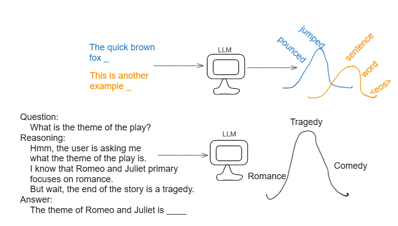

Through this process (and further fine-tuning and reinforcement learning to tune LLm output), the LLM learns how to "reason" through problems before answering them. This framework resulted in better performance on Q&A evaluations, and often the ability to solve more complex tasks.

## A brief discussion on r1

I would be remiss to write an article about DeepSeek-r1 without giving my take on it. 🙂

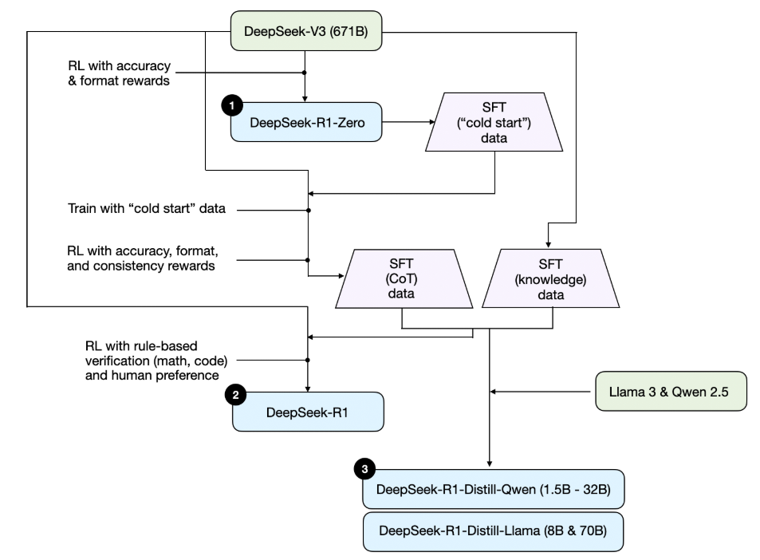

Most articles I've read seem to highlight that DeepSeek-r1 utilized reinforcement learning prior to Supervised Fine-Tuning (SFT), and this new training pipeline was the key behind their improvements. While it most definitely is a contributor, I'd like to discuss a few components from the paper that I feel are far more important novelties.


### They did it cheaper?!
A lot of the cost reduction of Deepseek comes from the fact that they were constrained to cheaper GPUs, but optimized these GPUs to yield performance comparable to the expensive ones that OpenAI used for o1.

I will save a deep dive on this for perhaps another article, but DeepSeek effectively optimized the parallelism and resource utilization of their GPU kernels, allowing for them to get more bang for their buck on these lower-end GPUs.

### Low level AI changes.

The following are some of the low level changes that DeepSeek implemented to improve their training and inference capabilities.

#### Multi-token prediction

Deepseek predicts not just the next token in the sequence, but attempts to predict up to the next 2 tokens. This is done by passign the output from the first transformer block into consecutive blocks for the next 2 tokens. This allows the model to peek ahead and consider potential future context.
  
#### Optimizing memory allocation during inference - Multiheaded Latent Attention and the KV Cache

While LLMs are generating tokens, the previously generated tokens impact the next tokens to be generated. This is sometimes referred to as the context window of the LLM, and describes how far in the past information can impact an LLM. (e.g. Will information at the start of your prompt be relevant if your prompt is several paragraphs long?)

KV caching is a technique used to save on compute when taking into account those past tokens. Rather than recomputing Attention matrices for all previous tokens every time we generate a new token, we cache the model's interpretation of these tokens (Key and Value vectors), so that we need only look them up. However, this cache soon becomes massive, and previous models used something called grouped query attention to reduce the size of the KV cache by an order of magnitude. 

Grouped query attention(GQA) assigns multiple query heads to each pair of key and value heads, effectively grouping the query heads together. You can think of an attention/query head as an aspect of a sentence that the LLM focuses on (similar to a feature in a traditional ML model). Maybe you have an attention head for verbs, and one for context. GQA reduces the memory of the KV cache and lowers inference time by grouping these Query heads together to have the same KV values. Meaning that now, for example, an attention head about verbs and one about context will comprehend the sentence in the same way, rather than having unique representations. As you might expect, this degrades model performance.

So DeepSeek comes in with Multi-Head Latent Attention (MLA). A common technique in AI recently has been compressing information with low-rank approximations. (You can multiply two small matrices together to recover a large matrix, so why not store the large matrix as two small ones). They apply this exact concept onto the the KV cache, and utilize compressed latent KV vectors when computing attention. The key here is that we are not compressiong each individual KV vector for each attention head. We are concatening all of the KV vectors as the KV cache, and then compressing that. This allows all of the attention heads to utilize the same compressed representation. The trick is that different attention heads store a lot of redundant information, and so compressiong the KV cache and allowing all heads to utilize it, speeds up inference time without significantly harming model performance.

Analogy:
- Imagine you're in a big international meeting where people speak different languages. There are multiple translators (attention heads) each responsible for a different language. Every translator writes their own notes in their language. 

Storing the vast amount of notes for each language is too costly, so we need to reduce the volume somehow.
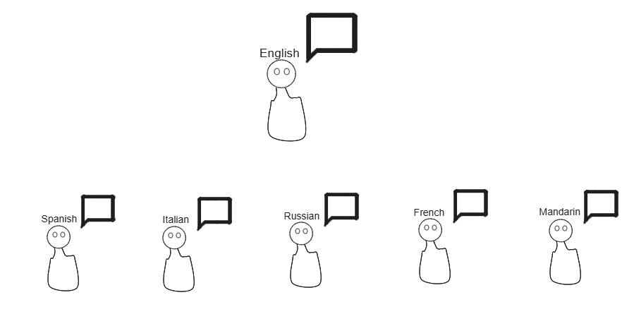
GQA:
- Perhaps similar languages like Spanish and Italian can share notes.
- But if we want to summarize, we'd still have to combine each translator's notes. This is costly, and we lose some information when translators have to share a set of notes.
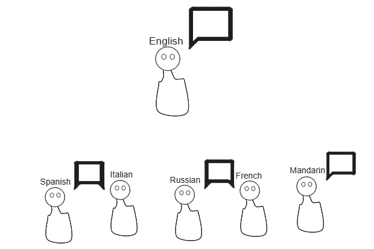

MLA:
- A summary is dynamically generated as the meeting progresses. This way each translator can reference and translate the summary into their own language. 
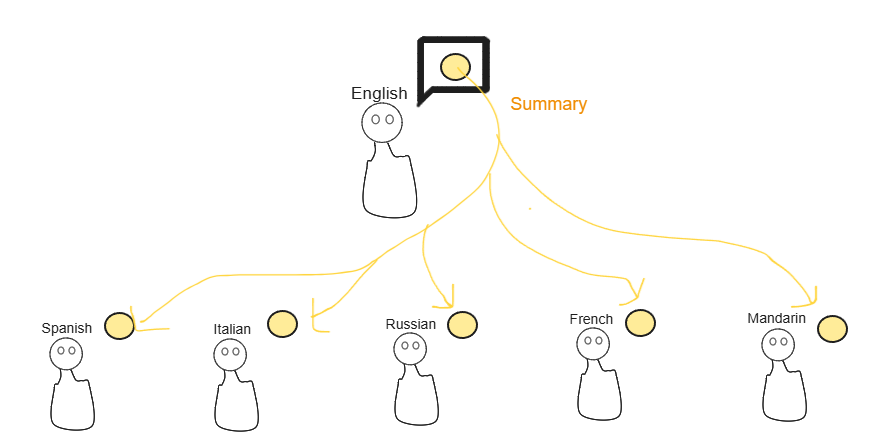


#### Loss free load balancing

Mixture of Experts is another paradigm that has emerged in the past year and boosted model performance. It is essentially load balancing that occurs during training that divides the neural network into multiple distinct experts. This allows for the model to "know" much more and have many more parameters without having to activate all of them for a given set of tokens. Meaning that MOE models can use only a portion of their "brain" when answering questions, while still having other, unused neurons capable of answering other questions.

DeepSeek reduced unnecessary computations during training by opting for a Mixture of Experts model. But this alone isn't novel, there are existing MoE models already in the market. 

The problem is that in the past, models tend to dump all of the training into a select few experts. Load balancing was added to try and balance training, but this "routing" was baked into the gradient descent loss function as a regularization term. The model would be penalized if it did not balance where it sent training examples to properly. While this may enforce a balanced training of each expert, the optimal training scheme is likely somewhere in between. For example, you might use the frontal motor cortex of your brain for voluntary movement much more frequently than the amygdala for processing emotions. (Not really true, but just an example). 

Deepseek removes this load balancing process from the loss function (leading to more stable training and optimization of language understanding from the LLM), and finds the balance of MOE training by first picking the top k experts that are elligible for training from a given example, and then balancing the load between those experts. That way experts are trained on data they have a natural affinity for, and this results in a better performance than a forced uniform distribution between experts.


--
*This section largerly references these articles: https://epoch.ai/gradient-updates/how-has-deepseek-improved-the-transformer-architecture*

*https://medium.com/yugen-ai-technology-blog/deepseek-v3-advances-in-moe-load-balancing-and-multi-token-prediction-training-f6d68c59749c*

## Comparing deepseek-r1:1.5b with an SFT model

I wanted to analyze whether or not the number of thinking tokens that a model had to generate to answer a question was a good estimator of how difficult that question was. 

To start, I found a dataset of ~466 USMLE questions with labaled difficulty scores, and subset this down to 100 examples.

**difficulty: 0.264706**
```
A 27-year-old man comes to the emergency department because of a 3-hour history of pain around his navel. He also has had nausea and one episode of vomiting 1 hour ago. During the past year, he has had multiple episodes of dark stools, which last for 2 to 3 days and resolve spontaneously. He underwent an appendectomy 2 years ago. The patient says that his current symptoms are similar to those he had during the appendicitis episode. His temperature is 39.0°C (102.2°F), pulse is 94/min, respirations are 22/min, and blood pressure is 114/78 mm Hg. Pulse oximetry on room air shows an oxygen saturation of 99%. Physical examination shows rebound tenderness localized over the right lower quadrant. Results of laboratory studies are shown: Hemoglobin 12 g/dL Hematocrit 36% Leukocyte count 18,000/mm3 Platelet count 350,000/mm3 Serum    Urea nitrogen 20 mg/dL  Creatinine 0.7 mg/dLCT scan of the abdomen shows fat stranding in the mesentery of the small bowel with an area of inflammation in a segment of the small bowel. Urgent laparotomy shows a segment of inflamed small bowel in the terminal ileum; there is a 2 x 2-cm bulge in the antimesenteric border of the inflamed segment. Histologic examination of a biopsy specimen of this bulging area is most likely to show which of the following in this patient?

A) Choristoma
B) Ciliary epithelium
C) Endothelial cells
D) Gastric mucosa
E) Striated muscle
```

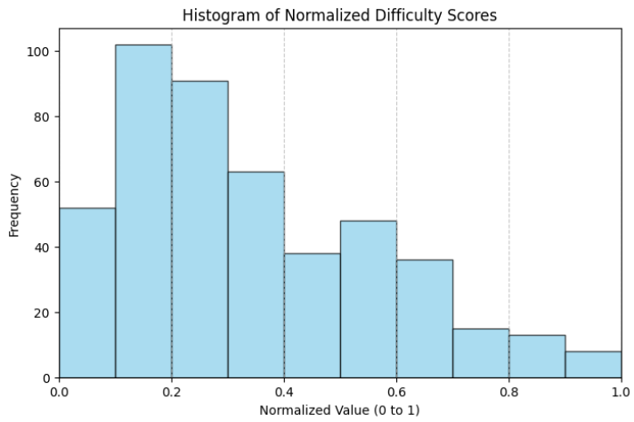

I ran deepseek-r1:1.5b locally with Ollama, and attempted to answer all of the questions, using fuzzy matching to check if the LLM answered the question correctly. (To set up deepseek locally with Ollama: https://www.datacamp.com/tutorial/deepseek-r1-ollama)

Interestingly, I found a slight correlation between difficulty and thinking tokens.

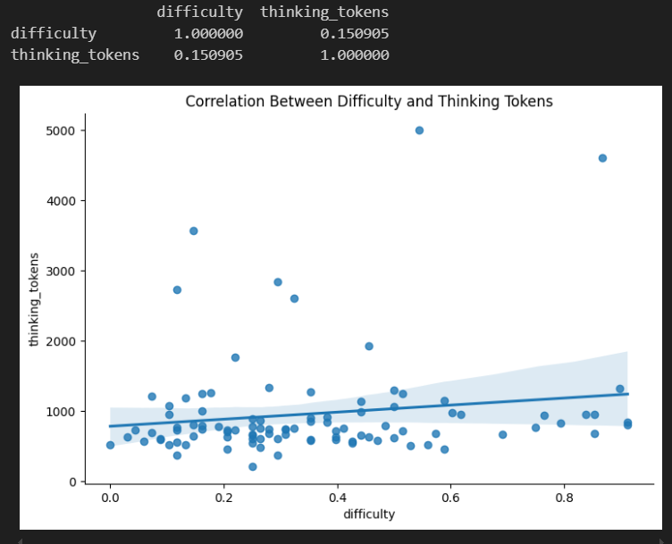

However, the model only got ~25% of the questions correct, so there was much room for improvement before a relationship could be identified.
```
correct
False    72
True     28
Name: count, dtype: int64
```

Next, I used [unsloth](https://github.com/unslothai/unsloth) on Google Collab to fine tune the deepseek-r1:1.5b model on a medical reasoning dataset. [Here](https://colab.research.google.com/drive/1Mxy7BbJSWR6BCmz_z4lT1YioWPdxnLdn?usp=sharing) is my google collab notebook for fine tuning. Unsloth is great because it vastly reduces LLM training time. It does this by optimizing several of the underlying mathematical computations with attention heads and matrix multiplication.

I saved the model with 4bit quantization to reduce the model size and inference time, and in GGUF (GPT General Unified Format) so that it could be downloaded and run locally with Ollama. 

Running this finetuned model for medical reasoning, I expected to get a much better performance, but unfortunately the accuracy was only slightly improved:
```
correct
False    61
True     39
Name: count, dtype: int64
```

### Investigating the token distributions of the train and test dataset.

I compared the token distributions of the medical reasoning dataset and the USCMLE question dataset to see how similar these datasets were. [The medical reasoning dataset](https://huggingface.co/datasets/FreedomIntelligence/medical-o1-reasoning-SFT) was constructed from gpt-4o using chain of thought to try and answer various medical questions. As their [paper](https://arxiv.org/pdf/2412.18925) suggests, some of these questions came from USMLE Q&A datasets.

I computed the KL Divergence (metric for the probabalistic distance between two distributions) and the Jensen-Shannon Divergence (a sort of 'normalized' version of KL Divergence)
```
KL Divergence: 1.4298
Jensen-Shannon Divergence: 0.1121
```
This told me that there was a significant divergence between my two distributions, so perhaps fine-tuning may be less effective than I had first thought with this dataset.

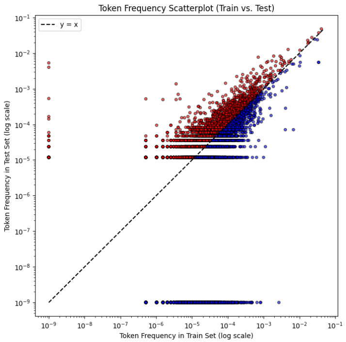

## deepseek-r1:8b vs SFT Llama-8b

Before dismissing fine-tuning and this approach, I wanted to try repeating the process with some larger models. 1.5b models are the smallest distilled size of Deepseek, and don't perform very well. I was pretty limited in hardware (stuck on my old laptop for the month), but I was able to replicate the above inference and fine-tuning with the 8b models.

The 8b model did much better on the question accuracy, getting almost 60% correct:
```
correct
True     59
False    41
Name: count, dtype: int64
```
The correlation between tokens and difficulty remained "slight".
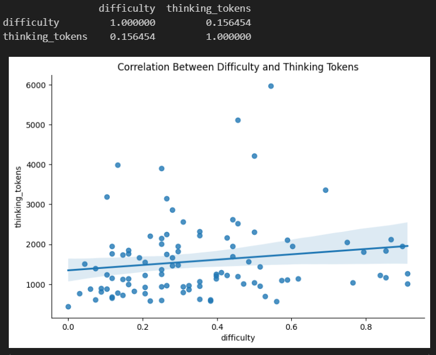
And interestly, there was a correlation between difficulty and whether or not the LLM answered the question correctly (perhaps as expected).
```
                 difficulty  correct_numeric
difficulty         1.000000        -0.323688
correct_numeric   -0.323688         1.000000
```
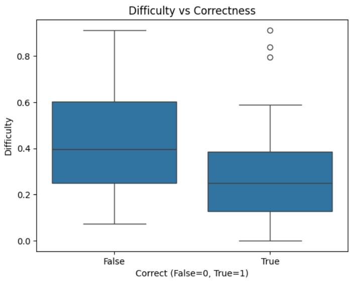

The finetuned 8b model did just about as good as the non-finetuned version:
```
correct
True     60
False    40
Name: count, dtype: int64
```

Interestingly, **The correlation between think tokens and difficulty seemed to dissappear in both the 1.5b and 8b finetuned variants.**
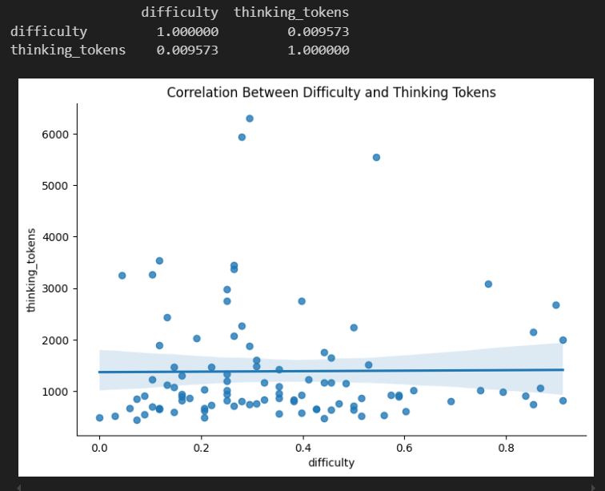

And interestly, the difficulty vs correctness correlation decreased as well.
```
                 difficulty  correct_numeric
difficulty         1.000000        -0.105306
correct_numeric   -0.105306         1.000000
```
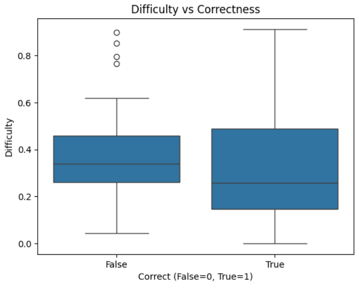

This could be because a finetuned model needs less think tokens to arrive at an answer given it is privy to more relevant knowledge. 
But it is also possible that the dataset is not the best alignment to be fine-tuning on, and that there is simply a reduction in thinking tokens due to the medical reasoning dataset, without a significant increase in accuracy.

## What is test-time scaling?

The original purpose of this project for me was to test whether or not allowing a reasoning model more time to think would result in an increased accuracy in question-answering.

This is a key insight that was found in a recent paper: [s1 Simple Test-Time Scaling.](https://github.com/simplescaling/s1)

I was inspired by [this r1 overthinker project](https://github.com/qunash/r1-overthinker/) to attempt to set a minimum (or even maximum) number of think tokens for the LLm to answer a question with, and see if that impacted the correctness of its answer.

### Attempting to test-time scale with Ollama streaming

Unfortunately I don't currently have the local computational resources to try this approach on a larger 32b model like s1. I attempted to use vLLM to do so, but ran into hardware constraints. I hope to attempt this in future steps.

What I did attempt to do was create a function to replace end of sequence/stop tokesn with tokens such as "Wait," or "So," to continue the LLM's thinking process. (Same as in the project linked above and the s1 paper).

The difference was I used Ollama streaming mode to set up a streaming request through the python requests library. This meant that if the API thought the LLM response was finished, I couldn't replace the end of sequence token to continue streaming the response. The proper way to do this would be to download a tokenizer and model locally, and replace the token as it appeared during model inference.

Nevertheless, I attempted to run this "test-time extension" on deepseek-r1:1.5b and finetuned 1.5b models.

Looking at the average number of thinking tokens, there did seem to be a significant increase with "test-time extension" via Ollama:

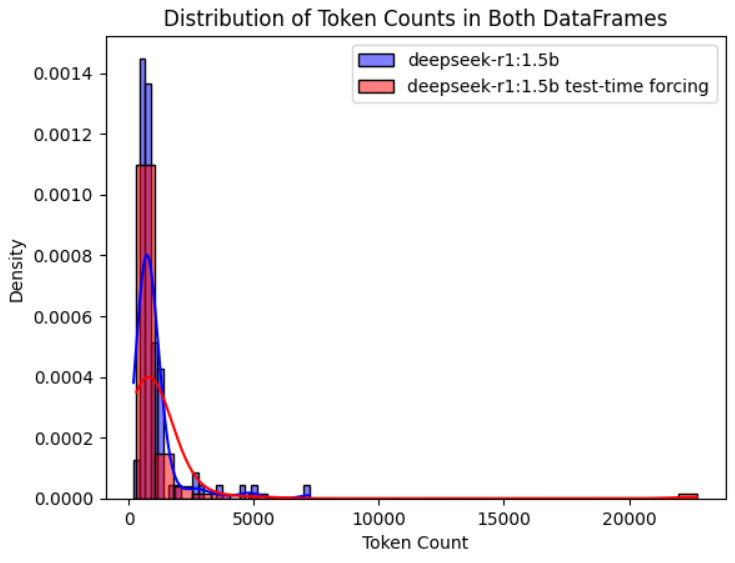

But on closer insepction, for a given question, the average token change minimal...

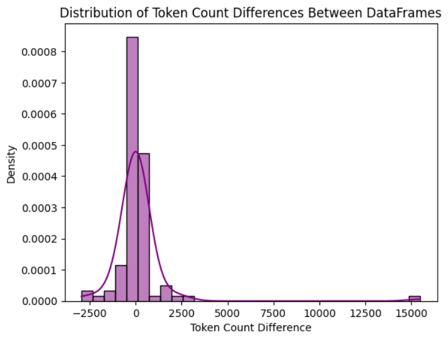

I found that the deepseek:1.5b model did improve in accuracy from ~25% to ~30%,
```
correct
False    68
True     32
Name: count, dtype: int64
```

and the finetuned model improved from ~30% to ~33%.
```
correct
False    67
True     33
Name: count, dtype: int64
```
The trends for difficulty vs. token count & difficulty vs. correctness persisted for the finetuned and non-finetuned models.


Now these are small enough improvements on a small enough sample size to be purely stochastic, so I would consider this nonconclusive.