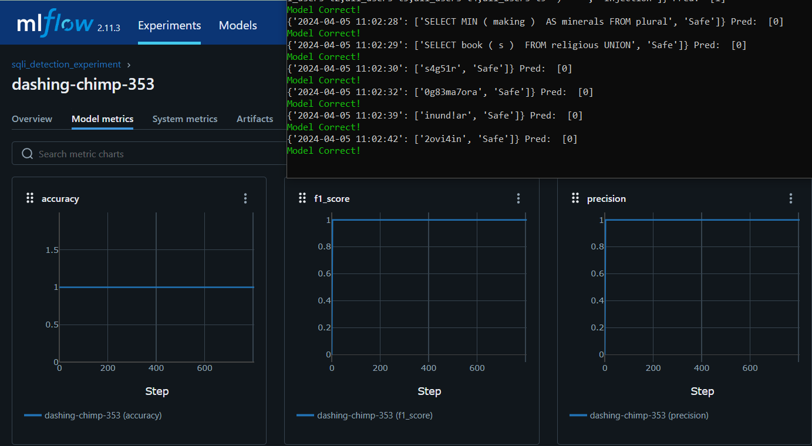

+++
title = 'SQL Injection Detection'
summary = 'Finetuning an LLM with contrastive loss to detect SQL Injection. Deployment onto Kafka stream hooked with MLFlow for data&concept drift detection + retraining.'
languageCode = 'en-us'
date = 2024-03-23
draft = false
tags = ['notes', 'reflections']
showRecent = true
showTableOfContents = true
+++
### Summary:

A BERT LLM sentence transformer model was fine tuned using triplet/contrastive loss to achieve 99% accuracy on SQL injection detection. The model was deployed to a Kafka stream for real time detection, and MLFlow was used to capture model accuracy, along with classification metrics such as f1-score. Finally, data drift and concept drift were simulated, and a retraining process was built to trigger when model accuracy dipped below a certain threshold.

[Notebook](https://www.kaggle.com/code/ubitquitin/finetuning-bert-with-triplet-contrastive-loss/notebook) | [Github Repo](https://github.com/ubitquitin/kafka-sqli)



- - - - - - - - - - - -

# More Details:

### A gentle introduction to embeddings

Large Language Models (LLMs) learn the 'meaning' and 'context' of words by representing them numerically, in a high dimensional space. These are called embeddings, and are fundamental for a generative model's understanding of textual data.


> :bulb: Sentence embeddings; the length of these vector representations correspond to the dimensionality of embedding. You can think of it like "it takes n many attributes for the model to correctly understand the word".

These embeddings are learned during the training of a model, and are dependent upon the task that the model was trained to do. For example, when training a language model to complete an English sentence, it will learn embeddings (numerical meaning) for English words that best complete the sentence. This can be further refined with human annotation of what a good or bad completion of the sentence is (RLHF).
The takeaway here is that the LLM learns a numerical representation of words, therefore words have distance and relationship to one another.


> :bulb: In a high dimensional space, words have similarity and mathematical relation to one another. A simplified example is show above; perhaps a Wolf might be equal to a Dog + Lion - Cat.

But lets say my goal and therefore context was completely different. What if the words in the image above were not descriptions of animals, but instead chemical elements. Cat and Lion might be similar animals but **Carbon Astatine (C-At)** might be vastly different from **Lithium Oxygen Nitrogen (LiON).** *These are not real chemicals, but you get the point!*
The meaning and context of the words changes depending on the goal, and so therefore our numerical representation- our embedding must also change! This is called fine-tuning a LLM, in order to alter the generative task of the model.
> :memo: This is a simplified explanation. In reality, embeddings are generated for full sentences, and the context of a word in the sentence determines how it is embedded.

### SQL Injection dataset

SQL injections are one of the most common type of attack on pieces of software. The attacker uses a specific SQL query to gain access to sensitive information, tamper with existing data, or even execute malicious code on an application.
Let's get into the dataset. We are given a dataset of ~30,000 SQL queries, that are labeled as being a SQL injection attack, or not.


Clearly the textual content of the query is important in determining whether or not the query is an injection. Lets take an off the shelf LLM model and see if it can distinguish injections from the query text.
I use the python sentence transformers library (https://www.sbert.net/), to pull down a BERT model and generate embeddings for a sample of the queries in the dataset. 


> :memo: The embeddings that represent each query are now in the 'orig_emb' column. The embedding dimension (default) is 768, which is the length of each embedding array produced.

Now lets visualize these embeddings and color code them by their label. I don't know about you, but I'm not able to see in 768D, only up to 3D at the moment. So, we use a technique (t-SNE) to compress these 768 long vectors into only length 2. We essentially project this highly dimensional vector into a lower dimension that we can visualize.


> :bulb: Dimensionality reduction. We project a 3d point (768d in actuality) for our words down to a 2d point


> :memo: t-SNE dimensions for the query embeddings

And now we visualize the embeddings and their corresponding class labels:


Nice! We can see that there is a pretty decent separation between injection and safe query embeddings. We could probably build a decent classifier off of this, but there is still some significant overlap. Can we do better?

### Finetuning with Triplet/Contrastive Loss

Remember how we can change the embeddings/numerical meaning for words if our task is different? Well that's exactly what we are going to do. You might have run into examples online where developers fine-tune LLM models by feeding them more sentence/completion pairs, but what we really want to do here is have our BERT model produce embeddings that are closer together for queries that are of the same label, and far apart for queries that do not have the same label. That way the numerical meaning of SQL injections will become distinct from the numerical meaning of safe queries!

*Enter Contrastive Loss:*

Contrastive loss is a loss function (*a mathematical formula that fuels the training and behavior of machine learning models*) that takes pairs of data points and aims to push the embeddings towards the true similarity or difference of those data points. Triplet loss is a type of contrastive loss, that uses pairs of three data points, one anchor, one positive class and one negative class, so that the model learns to embed the anchor and the positive class closer together, and the anchor and negative class further apart.


For our dataset, this means we might select a safe SQL query as the anchor, and make sure the model is embedding other safe SQL queries close together. We will also make sure that SQL queries that are injections will be embedded far away from the anchor.
Mathematically this can be expressed as the minimization of the following:


I won't get too into the weeds on this, but you can learn more about triplet loss from [this](https://medium.com/analytics-vidhya/triplet-loss-b9da35be21b8) great medium article.

So, we train our model with this triplet loss and visualize the new generated embeddings:


> :bulb: There is a noticeable difference between the original model and fine-tuned model's embeddings.


> :bulb: Wow! Now we see a clear margin between classes from our embeddings.

Just to be sure, the fine-tuned model also applies embeddings to some new queries that were withheld from our training set:


Still, quite a reduction in class overlap!

### Building the classifier

Just by drawing a line in that plot above, I could pretty much classify injected queries from safe ones. Mathematically, that's exactly what I do here, just in a higher dimensional space.


I build a Logistic Regression model, that essentially learns the proper curve fitting to separate the positive and negative classes.


Here are some metrics from the logistic regression model training:


This was from predictions on 2000 queries. Notably, the accuracy is 99.8% and F1 scores is 0.997.
Here is the confusion matrix, mapping true values to predicted values. Essentially, it is showing that 1289 safe queries were correctly predicted as safe, and 707 injections were correctly identified.
There was 1 false positive, (where the model predicted injection for a safe query) and 3 false negatives. (where the model predicted an injection as safe)


So overall, these are pretty promising results, and our fine tuned BERT model does a very good job at identifying SQL injection attacks from query text!

### Deploying as streamed data to a Kafka stream

I wanted to simulate an threat detection model that could alert in real time. To do so, I hooked the embedding model + logistic regression classifier to the end of a Kafka stream, and used MLFlow to monitor metrics.


Using [this](https://github.com/mtpatter/time-series-kafka-demo) tutorial, I was able to get a Kafka consumer and producer with a topic set up locally pretty quickly.


I set a random wait of 1-10 seconds to simulate 'real time' events coming into the stream. Additionally, I used MLFlow to track rolling accuracy, recall, precision and f1-score of the classifier.

Most of this was quite built in, and required few lines of code to set up!

### Data drift, Concept Drift & Model retraining

In production, MLOPS systems often need a means to respond to a drop in model accuracy/performance. This drop will naturally happen over time, as the distribution of data shifts, or the definition of the problem changes. The shifting of data distribution is called **Data Drift**, and the changing of the problem definition is called **Concept Drift**. I wanted to simulate these for my SQL Injection stream, and use MLFlow to kick off a model retraining if the accuracy fell below a set threshold.

To simulate data drift, I found another SQL injection dataset on Kaggle. This could potentially represent new datapoints for the same problem, that may have been generated or pulled from a different underlying source, and be statistically different than the dataset the model was trained on.

To confirm this, I ran a script to embed both datasets, and create another t-SNE plot of the embeddings. 


Although there is some overlap, we can see that the two datasets are distinctly distributed in the reduced dimensional space. This is a good sanity check that the model may perform slightly worse on the new dataset, or at least be dealing with a new type of data.

Additionally, I further reduced the dimensionality down to just 1 tSNE component. This was the result of plotting the distributions of both datasets. 


We can see again, a nice distinction, but let's be a little more mathematically thorough. I compute 3 different metrics of data distribution similarity: **KL divergence**, **Population Stability Index (PSI)**, and I run a **Kolmogorov-Smirnov test** for goodness of fit. I will describe each of the methods below, but feel free to skip. 


The results for all 3 methods show that there is significant data drift between our two datasets, and that model retraining is necessary to maintain performance.

- - - - - 

*Aside:* 


> :memo: Kullback Leibler Divergence (KL Divergence) is a statistical distance of one probabiliy distribution P from another probability distribution Q. It can be interpreted as the difference between two probability distributions, P&Q, and is often used in machine learning in the loss function optimization. If we have certain prior distributions for our optimization, we can add a term to our loss objective to constrain the prediction distribution to some existing prior distribution via KL divergence. 


> :memo: Population Stability Index (PSI) is similar to KL Divergence, but is the symetric KL Divergence (KL(a,b) + KL(b,a)). It can more directly be calculated discretely by binning the X-axis of the distributions into N number of bins, and calculating the difference between the number of entities for each distribution that fall into these bins. 


> :memo: Lastly, the Kolmogorov-Smirnov test is a statistical test where the null hypothesis is that the two distributions are statistically identical, and the empirical cumulative distribution functions (eCDF) between the two distribution samples are compared. In layman's terms, we sort the data and look at the cumulative distirubtions of both datasets, and the differences between the distribution functions. A test statistic and p-value for the null hypothesis are calculated from the differences in these distribution functions. Above are the eCDFs for both SQL Injection datasets, we see a large difference overall, and our KS-test pvalue ended up being essentially 0; so extremely statistically significant. We can then reject the null hypothesis that the distributions are the same, and conclude data drift has occurred!


- - - - - 

To simulate concept drift, I changed the problem definition. The query datapoints would now be random seequences of characters, and a query would be an 'Injection' if it contained **any** special character. This would likely result in a dramatic degredation of model performance, as the new underlying task would be significantly different than the old one.

```
# SQL Injection has now changed into a hypothetical attack pattern
# where if there are any special characters in the input string it
# constitutes an attack.
def concept_drift():
    letters = string.ascii_letters + string.punctuation + string.digits
    inputstr = ''.join(random.choice(letters) for i in range(random.randint(1, 30)))
    regex = re.compile('[@_!#$%^&*()<>?/\|}{~:]')
    
    if regex.search(inputstr) == None:
        label = 'Safe'
    else:
        label = 'Injection'
    
    return (inputstr, label)
```

I adjusted the Kafka producer to produced normal data from steps 0-1000, data drifted data from steps 1000-2000, and concept drifted data from steps 2000+. We can clearly see the model accuracy slightly drops once data drift starts, and more significantly degrades after step 2000: 


Sweet, now lets see if we can deal with this decrease in performance.

I use MLFlow to initiate a model retraining of the logistic regression model on the last 500 datapoints seen in the stream if the accuracy drops below an average of 90% across the last 10 steps for at least 5 consecutive steps. The metric history of accuracy is fetched by using the MLFLow Client class functionality, and I store the last 500 datapoints in a queue, popping old entries out as new data gets processed by the stream.

Now we can observe model retraining bringing the accuracy back up over the threshold.


Huzzah, we've retrained our model for the new task, combatting concept drift in a producton environment!
