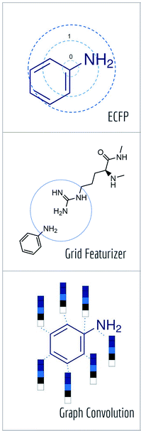
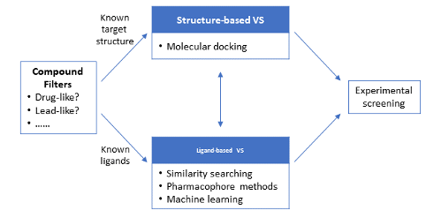
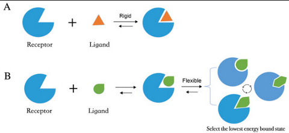
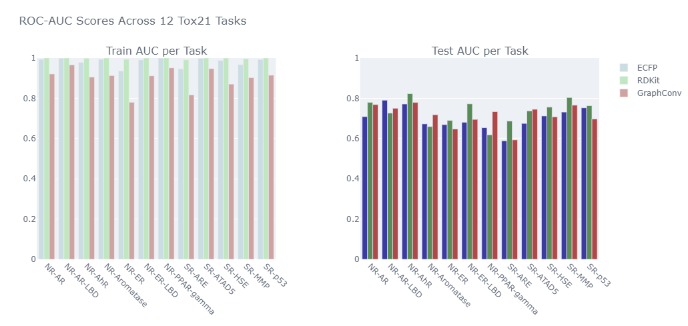
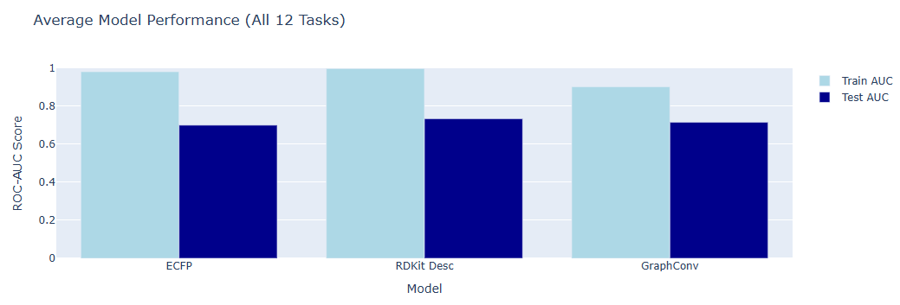
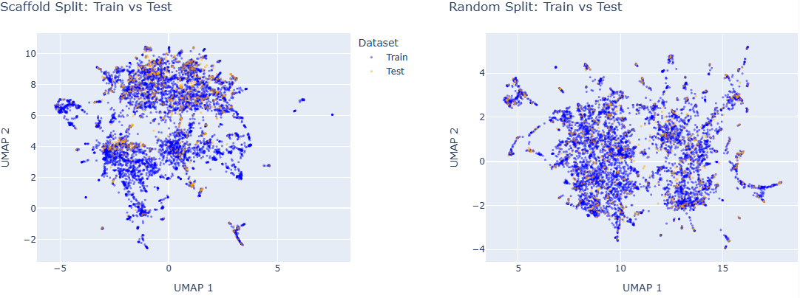
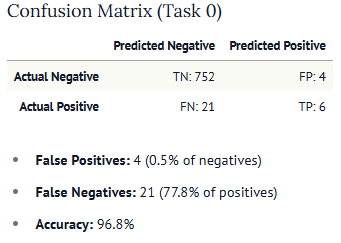
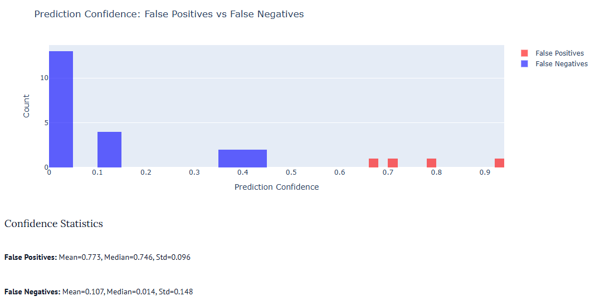
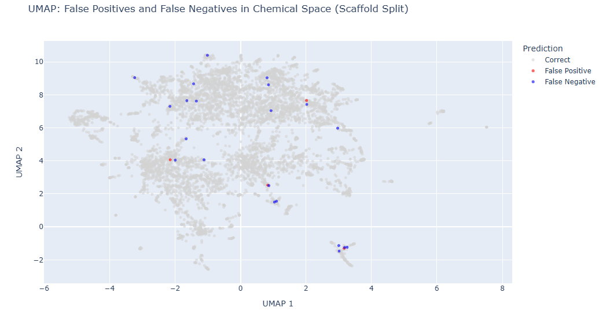

The goal of this week was familiarizing myself with the fundamental tools used in computational biochemistry and molecular representation.

# TLDR;

Learned about different molecular representations, importantly RDKit descriptors and Morgan Fingerprints. Learned about the DeepChem library and how to build an end-to-end ML pipeline on the datasets contained in Deepchem's MoleculeNet.
Did an excercise training a Graph Neural Net (GNN) and Light Gradient Boosted Machine (LGBM) on different feature representations to predict ADMET toxicology (tox21 dataset). Visualized embedded distribution of molecules using UMAP in Marimo.

# Molecular Featurization and Representation

I started by learning about several various representations of molecules.

- SMILES: Simplified Molecular Input Line Entry System. The connectivity of a molecule as a graph using ASCII strings. Includes single, double, triple, aromatic bonds, rings and branching.
    - Example: N1CCN(CC1)c(C(F)=C2)=CC
- InChI: International Chemical Identifier. Distinct layers of information including hemical formula, atom connectivity, tautomeric information and stereochemistry.
    - Example: 1S/C2H6O/c1-2-3/h3H,2H2,1H3
- SELFIES: Self referencing embedded string. Representation created for computational biochemistry. Similar molecule graph information (atoms, bonds, connectivity) but uses a strict grammar to ensure that any string created represents a chemically valid molecule.
- Morgan Fingerprints
    - Circular Fingerprints built by iteratively expanding the neighborhoods around each atom.
    - Creates a fixed-length vector representation of a model, by hashing molecular features as one hot encoded binary bit dictionaries.
    - Features can then become hierarchical as we zoom out.
    - ECFP is a well defined parameter set for Morgan's Fingerprint algorithm that is often ued. ECFP4 (radius = 2), ECFP6 (radius = 3).
- MACCS Fingerprints: Similar to Morgan fingerprints but uses a static 167 binary one hot encoded feature reprsentation.

Another featurization technique similar to Morgan Fingerprints is using RDKit Descriptors.

RDKit is a python library that is like a swiss army knife for cheminformatics. It can convert between representations, and I plan to learn more about its capabilities as I progress.

RDKit has a "Descriptors" set which is a set of hand-engineered numerical features extracted from a molecule. RDKit currently has 200+ descriptors, which include information about size, shape, polarity, topology and electronic properties. I learned about some of these features, which can be used as input features to a machine learning pipeline.

## Lipinski's rule of 5

Lipinski's Rule of 5 is a guideline in medicinal chemistry that predicts whether a chemical compound is likely to be an orally active drug in humans. It can be used as a set of constraints in molecular screenings for drug discovery.

The rules are:
- Molecular Weight < 500 Dalton
- LogP < 5 (Lipophilicity - How fat soluble)
- H donors <= 5 (total number of N-H and O-H bonds)
- H acceptors <= 10 (total number of N or O atoms)

## ADMET

ADMET (Absorption, Distribution, Metabolism, Excretion and Toxicity) is another framework that assesses how a drug behaves in the body. Often, AI and ML models are aiming to predict ADMET properties by analyzing molecular representations to predict one of the above properties. Experimental assays measure in vitro chemical properties for ground truth.

# DeepChem

DeepChem is a python library that provides an end-to-end ML pipeline for scientific data. It bundles together:
- Datasets (stored and documented in DeepChem's MoleculeNet)
- Featurization tools (chemistry-aware representations)
- Models (GNNs, transformers, classical ML, physics-based)
- Training + evaluation utilities
- Integrations (RDKit, PyTorch, Tensorflow, etc)

Basically it takes raw scientific data (and has many datasets of this) and runs it through featurization, modeling, training and evaluation. Where RDKit turns chemistry into structured data, DeepChem takes RDKit features and trains ML models on them. I went through the first few DeepChem tutorials, and used DeepChem for my first week's project. I will talk more about it in that section. You can think of it like Pytorch or Torch Geometry but for Molecules.

# Virtual Screening

I started reading an online cheminformatics textbook and learned about computer-aided drug discovery and design. Virtual screening is a computational technique used in drug discovery to prioritize the compound selection from a large compound library for subsequent experimental assays. It is a cost-effective and high-throughput method for drug screening. I imagine most companies are doing this for drug discovery.

## Structural-based approaches

The first type of virtual screening needs 3D structural information of the target molecule to dock the candidate molescules and rank them based on their predicted binding/complementarity. They require a docking algorithm, which is the methodology by which the binding is simulated, and a scoring function, which provides an evaluation for binding affinity in the virtual screen.

Docking algorithms can be rigid (treating the molecuels as rigid bodies), or flexible (where the ligand can be altered to a nearby lower-energy state). Systematic methods incorporate ligand flexibility by gradually changing structural properties such as torsional angles, deggrees of freedom, etc. Stochastic methods make random changes to the ligand structure, generating an ensemble of ligand-protein interactions to find a low energy conformation. Genetic algorithms, which are a type of search algorithm, can also be used.

Scoring functions can be force-field based, meaning that the docking is evaluated by experiminetal data and quantum mechamical calculations. There are common algorithms used with this methodology such as DOCK and AMBER. There are also empirical scoring functions, which express the binding energy of a protein-ligand complex as the sum of experimentally derived terms. Consensus-scoring functions are often used, which use multiple scoring approaches together.

## Ligand based approaches

Ligand based screening approaches allow for drug targets to be found without needing the 3D structural information of the target macromolecule. The aim is to find molecules that are similar to those that bind with the target, under the assumption that similar molecules are likely to have similar physicochemical and biological properties.

These usually use either pharmacophore methods, that aim to identify key features of a molecule necessary for it to interact with the target, or machine learning methods, that use prediction models developed from a training set containing known actives and inactives. Sometimes ADMET properties are prediction in addition to how tightly a potential drug molecule can bind to the target molecule. These properties can impact the oral bioactivity of the drug and screen it out as a usable drug.

# Pat Walter's blog

The first blog that was suggested to me to read was by Pat Walter. He seemed to be an expert in the space, and is a chief scientist at OpenADMET. So I went to his website and started reading...

## DUD-E Dataset

The first article I read talked about how many papers cite state of the art performance but do so using a flawed dataset. He mentioned the DUD-E dataset, which is a collection of datasets for analyzing docking (interaction/binding). He pointed out that while the dataset has known actives and falsely created decoys, the decoys are so distinct in their distribution, that training any model on one of the DUD-E datasets will allow it to perform well on ALL of the datasets. Meaning that the ML model is not learning any innate property of the drug chemistry, it is simply learning to distinguish between two statistically significant distributions of molecules.

## Marimo

The next article I read was about Marimo. This looked like a useful tool to perform analyses. It is essentially like a Jupyter notebook, but importantly:
1. Has a reactive execution model. It uses a DAG to track dependencies between cells, so it will auto-rerun any cell that has a dependency on a variable you changed. (Annoyingly this means you can't redundantly define any variables or Marimo will complain.)
2. Jupyter notebooks are stored as json files, but Marimo is just stored as .py. This makes it more Git friendly.
3. No need for ipywidgets or complex callback functions. Marimo has native UI interactivity and follows a "variables as widgets" pattern.

Pat also built some utilities for cheminformatics with Marimo: `marimo-chem-utils`.

# Project

Project notebook here: https://molab.marimo.io/notebooks/nb_JvPL9UJ6L4msRGCuHgsFwE

For the weekly project I wanted to combine many of the techniques and technologies I had learned about. I decided to create a marimo notebook where I would use various feature representations and splitting methods to try and train a ML classifier on the tox21 dataset to predict toxicity using DeepChem. The tox21 dataset contains 12 subtasks for the molecules, corresponding to 12 assays/experiments that measure toxicity of molecules.

Using DeepChem and RDKit I featurized the tox21 molecules (from DeepChem's MoleculeNet) in 3 ways: As Morgan Fingerprints, as RDKit descriptors and as GraphConv features.

The first two I talked about above, being one hot encoded molecular feature dictionaries. GraphConv features a molecular graph similar to how convolutional layers in a neural network featurize an image. They take properties of a node (atom in a molecule in this case) and average with properties of the neighboring nodes to create a local representation of that part of the molecular graph. This can be stacked as node representations gain more information about the local and global structure/interactions. Then the node representations can be stacked as a vectorized representation of the full molecule. This resource was very helpful in gaining an intuition of graph featurization: https://distill.pub/2021/understanding-gnns/ I will spend some time next week going into the specific types of graph neural networks and likely reference this resource again.

So with the tox21 molecules featurized in 3 different ways, I used deepchem to load the molecules with 2 types of train-test splits, random, and scaffolded, which separates molecules such that those with the same molecular backbone end up in the same training set. This ensures no leakage of largely similar structures across sets, artificially boosting performance. With these 6 train-test sets, I trained a LightGBM model (a tree based method that aims to maximize information when trying to classify) on the RDKit descriptors and Morgan Fingerprints, and a GNN on the GraphConv features. I measured training AUC classification metrics across the 12 subtasks of the tox21 dataset,

and compared the classification accuracy between the 3 different models.

I used UMAP to project the featurized representations of the molecules into 2D space, and used marimo to plot scatterplots of the training and testing splits for random and scaffolded splits.

There was significantly less overlap, as expected, in the latent space of the scaffolded split as opposed to the random split. This means that there was likely less train/test split and models trained on scaffolded splits could likely generalize to new molecules better.

I also looked at false positives and false negatives for the LightGBM classifier on Morgan Fingerprints for tox21 task 0.

This showed a large class impalance. There were way more negative molecules than positive ones, and the model actually missed more of the positive ones (false negative) than it correctly identified (poor recall). I grabbed the logits from the LightGBM's prediction probabilities (how confident it was in it's classification) and plotted the confidence of the false positives and negatives.

Overall the confidence was much higher for the false positives, indicating that the model would boldly claim something was toxic when it was not, but was quite unsure when it came to a molecule that was toxic, but it still decided to mark it safe. This means that the recall could likely be improved with a small adjustment to confidence threshold for the classifier. In other words, if we enforce that the classifier needs to be very sure before calling something safe, it would then classify those low confidence molecules as toxic after all, though this would result in more false positives as well.

Lastly I looked at where the false positives and negatives showed up in the latent space, and printed some examples of them.

Overall I found that the featurization and model type for this task was marginally important. The Scaffold split was necessary over random split to prevent data leakage.

---

I hope you enjoyed learning about my learnings this week if you read this far. Stay tuned for next week where I hope to learn more about what companies are doing and what is state of the art.